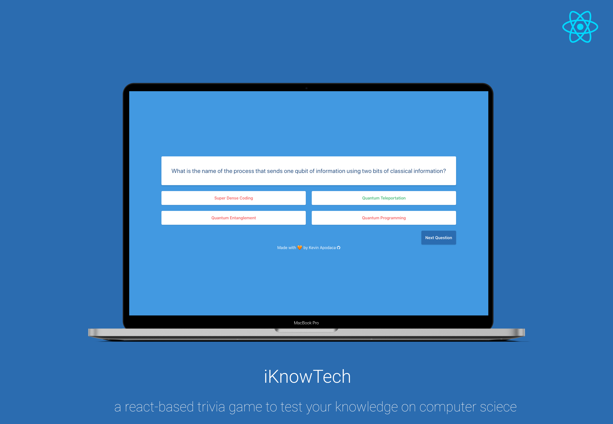

<h1 align="center"> iKnowTech </h1>  

  

  A trivia game app that tests your knowledge of computer science.

## Introduction

This react-based web app uses [OpenTriviaDB](https://opentdb.com/api_config.php) to fetch random computer science questions. 

  

Take the quiz [here](https://iknowtech-40c5d.web.app/).

### Installation

You can run this app and change the types of questions by running the app locally. To do so:
1. Clone this repo and `cd` into it. 
2. Run `npm create` to download the dependencies and run the app.
3. Change the value of `TRIVIA_URL` in *App.js* to your api url.
